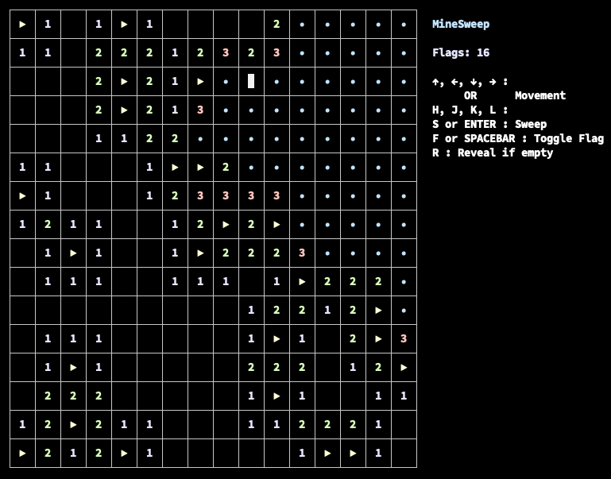

# MineSweep

Command Line version of MineSweeper for Unix-like systems (GNU/Linux, macOS, BSD).

</img>

## Prerequisites

- C++11 compiler

## Installation

```bash
$ git clone https://github.com/eliot-akira/minesweep.git
$ cd minesweep
$ make
$ ./mine
```

## Notes

Forked from https://github.com/unknownblueguy6/MineSweeper

Changes:

- Simplified
- Cleaned up UI, grid, colors
- Added "Reveal" action, to safely show empty space
